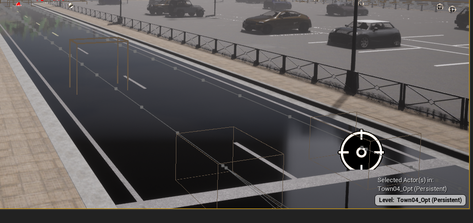

# CARLA Interface for Scenario-based Testing

Evaluate scenarios using a highly parallelizable CARLA setup!

```
from carla_simulation.balancer import Balancer

b = Balancer(
    directory = '/tmp/scenarios',
    jobs = 1,
    visualization = True
)

b.start()

evaluation = b.run()

b.stop()
```

## Prerequisites

### Environment
Make sure that the following environment variables are set correctly:
 * `TOKEN`: gitlab_acces_token
 * `SHARE_PATH`: path to the FMUs of your test system
 * `LAUNCH_PATH`: path to the launch file of your test system

 * To use local repositories, they can be cloned from the following URLs, but are not necessary:
    * `ROSCO_PATH`: https://git.fortiss.org/ff1/rosco.git
    * `OPENSBT_RUNNER_PATH`: https://git.fortiss.org/opensbt/carla-runner.git
    * `CARLA_PATH`: https://github.com/carla-simulator/carla.git (Tag: `0.9.15`)
    * `SCENARIORUNNER_PATH`: https://github.com/carla-simulator/scenario_runner.git (Tag: `v0.9.15`)

If you are using an IDE, this can usually be done through some run configuration options.

As example when cloning the  OpenSBT Runner into `~/projects/carla-runner`, and then cloning all other repos inside the runner,
the following bash commands can be used to set up the environment overwritten for launching the software via the bash terminal.
In the example, all possible repositories are overwritten, even though only the variables `TOKEN`,`SHARE_PATH` and `LAUNCH_PATH` are necessary to start the runner.
```bash
OPENSBT_RUNNER=~/projects/carla-runner

export TOKEN=gitlab_acces_token
export SHARE_PATH=path/to/FMUs/of/test_system
export LAUNCH_PATH=path/to/launch_file/of/test_system
export ROSCO_PATH=$OPENSBT_RUNNER/rosco
export OPENSBT_RUNNER_PATH=$OPENSBT_RUNNER/carla-runner
export CARLA_PATH=$OPENSBT_RUNNER/carla
export SCENARIORUNNER_PATH=$OPENSBT_RUNNER/scenario_runner

```
Now it is possible to start the runner via the commands `~/projects/carla-runner/ && python test.py`

### Docker

Instructions to install Docker are available [here](https://docs.docker.com/engine/install/ubuntu/#install-using-the-repository). Make sure to also perform the post-installation steps required to manage Docker as a non-root user (see [here](https://docs.docker.com/engine/install/linux-postinstall/#manage-docker-as-a-non-root-user)). The NVIDIA Container Toolkit can be installed as described [here](https://docs.nvidia.com/datacenter/cloud-native/container-toolkit/install-guide.html#installation-guide).

### Functional Mock-up Interface (FMI)

In case the [FMI](https://fmi-standard.org/)-based agent shall be used, the `SHARE_PATH` must point to the directory containing the Functional Mock-up Units (FMUs). As of now, it is recommended to replace the example files in ROSCo's `share/` folder with the FMUs and configuration of the system to be simulated. Finally, the launch configuraiton in ROSCo's `launch/` folder must be adapted to reflect this change.

## Getting Started

The easiest way to get the CARLA interface up and running is to build it as a Python package and install it.

To build the package, run `python -m build` in the repository's root directory. Once completed, install the `*.whl` package found in the newly created `dist/` folder via `python -m pip install /path/to/the/package.whl`.

Next, import the package:

```
from carla_simulation.balancer import Balancer
```

Now, an instance of the `Balancer` can be created:

```
b = Balancer(
    directory = '/tmp/scenarios',
    jobs = 1,
    visualization = True
)
```

Here, the directory containing the scenarios to be executed must be specified. The `jobs` variable can be used set the degree of parallelization. It is optional an set to `1` by default. The `visualization` can be set to `True` in case a 3D rendering of the scenario execution shall be shown. It is off by default, as the visualization severly impacts the framework's performance.

The balancer's infrastructure can be started as follows:

```
b.start()
```

This can take some time, especially if the necessary Docker images are not yet available and need to be built first. Next, a server and a client container will be started for each job specified in the balancer's constructor.

Now, the scenarios can be run:

```
evaluation = b.run()
```

The `run()` function will execute all scenarios in the directory specified in the balancer's constructor and return a list of evaluation metrics - a set of metrics for each scenario.

Finally, the balancer's Docker infrastructure can be stopped and removed via its `stop()` function:

```
b.stop()
```

## Advanced Features

### Changing the Environment

#### Python API

The following functions are being offered in `environment.py`:
- `show(world, labels)`: removes all environment objects from the world, except the ones specified in the labels. [This](https://carla.readthedocs.io/en/latest/python_api/#carlacityobjectlabel) is a list of objects which can be untoggled.
- `color(world, filter_criteria, color, width, height, material)`: Changes the color and the texture of filtered objects. E.g. `filter_criteria=BP_StreetLight_6` to only paint a certain street light.
- `spawn(world, prop, transform)`: Spawns a specified prop from the [props catalogue](https://carla.readthedocs.io/en/latest/catalogue_props/) at the location specified in the transform object.
- `set_vehicle_physics(vehicle, torque_curve, max_rpm, moi, damping_rate_full_throttle, damping_rate_zero_throttle_clutch_engaged, damping_rate_zero_throttle_clutch_disengaged, clutch_strength, final_ratio, mass, drag_coefficient, center_of_mass, adjust_wheels, tire_frictions, damping_rates, radii, max_brake_torques)`: Applies the given dynamics to the specified vehicle. Check the documentation [here](https://carla.readthedocs.io/en/latest/python_api/#carla.VehiclePhysicsControl) and [here](https://carla.readthedocs.io/en/latest/python_api/#carlawheelphysicscontrol) to find out more about the parameters.

#### XOSC File

The following effects can be achieved by adjusting the scenario file:
- **Weather**: Please find the standard's description [here](https://releases.asam.net/OpenSCENARIO/1.0.0/Model-Documentation/content/Weather.html). Examples:
  - _Sun_: `<Sun intensity="1.0" azimuth="5.2" elevation="0.35"/>`. Hardcoded for `LK_highway_exit.xosc` scenario
  - _Fog_: `<Fog visualRange="1.0"/>`
  - _Rain_: `<Precipitation precipitationType="rain" intensity="1.0"/>`
- **Performance**: The maximum speed, acceleration and deceleration of the ego vehicle can be set as follows: `<Performance maxSpeed="69.444" maxAcceleration="200" maxDeceleration="10.0"/>`. Please refer to the [standard's documentation](https://releases.asam.net/OpenSCENARIO/1.0.0/Model-Documentation/content/Performance.html) for more information.

#### CARLA Sensors

The following effects can be achieved by adjusting the parameters for the sensors in the `fmi.py` file:
- **LIDAR**:
  - `atmosphere_attenuation_rate`: coefficient that measures the LIDAR intensity loss, see [here](https://carla.readthedocs.io/en/latest/ref_sensors/#lidar-sensor)
  - `noise_stddev`: standard deviation of the noise model of the LIDAR sensor, see [here](https://carla.readthedocs.io/en/latest/ref_sensors/#lidar-sensor)
- **Camera**:
  - The camera offers multiple parameters to change the `motion blur` and the `calibration`, see [here](https://carla.readthedocs.io/en/latest/ref_sensors/#rgb-camera).

### Simulating Triggering Events

| Triggering Event | Implementation |
| -----------------| ---------------|
| The camera sensor may not detect the lane boundaries because the lane markings are partially or fully covered. | Use RoadPainter to add snow or water layer on the street. |
| Obstructions may block the camera's view of lane markings, vehicles, or other objects. | Use the `spawn()` method. |
| The camera may have deteriorated performance in environmental conditions that reduce visibility, such as weather or low lighting. | Change the weather in the scenario file, e.g. blinding sun, fog, rain etc.|
| Environmental noise factors, such as light reflection or shadows, may affect the sensor's ability to detect lane markings, vehicles, or other objects. | <ul><li>`Camera`: offers multiple parameters to change the motion blur, see [here](https://carla.readthedocs.io/en/latest/ref_sensors/#rgb-camera).</li><li>`LIDAR`: offers `noise_stddev` to add environmental noise, see [here](https://carla.readthedocs.io/en/latest/ref_sensors/#lidar-sensor).</li></ul> |
| Atmospheric attenuation leads to LIDAR inensity loss which may affect the LIDAR's ability to detect lane markings, vehicles, or other objects. | `LIDAR` offers `atmosphere_attenuation_rate`, which measures the LIDAR's intensity loss, see [here](https://carla.readthedocs.io/en/latest/ref_sensors/#lidar-sensor). |
| The camera may not detect roadside landmarks, such as concrete barriers or guardrails, if there is low contrast between the landmarks and the roadway or other environmental features. | Spawn the props with the `spawn()` function and afterwards change the texture with the `color()`. |
| The camera may not detect lane markings if the lane markings have low contrast with the pavement or are below a minimum size or quality. | Use RoadPainter to change the lane markings. |
| Due to wear and tear, the vehicle may not function safely. | <ul><li>Use the `set_vehicle_physics()` function to depict functional misbehaviour.</li><li>Limit the vehicles maximum speed, acceleration and/or deceleration in the scenario file.</li><li>Manipulate the `carla.VehicleControl` object in the `run_step()` function of the `fmi.py` file to change the vehicles driving behaviour.</li></ul> |
| The vehicle or object in an adjacent lane may be outside the camera's field-of-view. | Adjust the scenario file in such a corresponding way. |
| If lead vehicle tracking is used in the absence of clear lane markings, the lead vehicle may exceed the visual range of the camera. | Remove lane markings in RoadPainter and adjust the front vehicles behaviour in the scenario to perform multiple fast lane changes in a row. |
| The camera, radar, lidar as well as the object trail/tracker algorithm may have limitations individually tracking multiple objects that are close together and moving at similar speeds. | Create scenario with at least two motorbikes or bicycles close next to each other, which look the same. |
| The roadway geometry, such as curvature or grade, may prevent the camera from correctly determining the distance to other vehicles, including the lead vehicle. | Add a lead vehicle to the `LK_roundabout.xosc` file or use a similar scenario. |
| The camera, radar and lidar may not detect certain environmental features with sufficient confidence, such as guardrails. | Add the carla.CityObjectLabel.GuardRail to the `untoggle_environment_objects()` function in order to keep guardrails visible. |
| The LIDAR and radar may not detect vehicles with thin profiles, such as motorcycles or bicycles, or objects below a certain size. | Adjust the scenario file to spawn motorcycles or bicycles in front of the vehicle. |
| The lane model algorithm may incorrectly categorize other roadway features, such as off-ramps or branching lanes, as a continuation of the current travel lane. | Simulate a complex traffic situation with multiple lane markings to confuse the lane model algorithm. |
| The lane model algorithm perceives other environmental features as the lane lines. | Add props (e.g creased box 03) with the `spawn()` function in a way that the props look like lane markings. |
| In the absence of clear lane markings, the object trail/tracker algorithm may track the incorrect lead vehicle. | Create scenario without lane markins and with multiple vehicles in front of the ego vehicle. |
| In the absence of clear lane markings, the object trail/tracker algorithm tracks a lead vehicle that is not staying centered in the travel lane (e.g., swerving, exiting roadway, changing lanes). | Create scenario without lane markings and a vehicle, perform a lane change in front of the ego vehicle. |
| The object trail/tracker algorithm may incorrectly assign the track of an object to the incorrect lane. | Create scenario with multiple lanes and place a vehicle 2 lines next to the ego vehicle. |
| The object trail/tracker algorithm may incorrectly determine that a vehicle in the adjacent lane is changing to another lane. | Create scenario, where a vehicle is steering left and right in the lane to throw off the object trail/tracker algorithm. |
| The object trail/tracker algorithm may not detect an object moving in front of the host vehicle during a lane change. | Create scenario, where the ego vehicle changes lane. |
| The object trail/tracker may not correctly detect or classify the entire vehicle or object. | Create scenario and spawn an [European HGV](https://carla.readthedocs.io/en/latest/catalogue_vehicles/). |
| In the absence of clear lane markings or landmarks, the road model algorithm incorrectly establishes the travel lane and/or the target lane. | Test the ego vehicle in a scenario without any lane markings. |
| The road model algorithm incorrectly estimates the road curvature and reports the incorrect curvature to the steerable path algorithms. | See how the ego vehicle in a roundabout, e.g. in `LK_roundabout.xosc`. |
| The environmental or roadway conditions may change suddenly, causing the system to reach the limits of its ODD sooner than expected. | The lane suddenly stops in front of a desert. |
| The highway chauffeur system may be incapable of safely bringing the vehicle to a stop in the middle of a maneuver. | During a lane keep maneuver another vehicle cuts right in front of the ego vehicle and fully brakes. |

### Fault Injection

To use the fault injection, the balancer needs the path to the directory containing the faults similar to the scenarios:
```
b = Balancer(
    scenarios_dir = '/path/to/scenarios',
    faults_dir='/path/to/faults',
    jobs = 1,
    visualization = True
)
```
Fault and scenarios names must match so that every fault has a matching scenario and vice versa.

The faults are defined as YAML as described in https://git.fortiss.org/fortissimo/rosco#fault-injection.

## Advanced Settings

### Run without Docker

The following code changes have to be done:

- In `infrastructure.py`, change the NETWORK mode to `host`, connect the CARLA client to `127.17.0.1` and remove any calls of the `get_address()` function.
- Optionally to avoid overhead in `infrastructure.py`, change the server image to `ubuntu` and set the command for the server container in `create_server_container()` to `sleep infinity`.
- In `runner.py`, change the host's IP address to `127.17.0.1`.

Then download the CARLA simulator and execute it with `export VK_ICD_FILENAMES="/usr/share/vulkan/icd.d/nvidia_icd.json"  && ./CarlaUE4.sh` in order to use the NVIDIA GPU locally.

### RoadPainter

In order to use the `RoadPainter`, a CARLA build from source is necessary. The official instructions on how to build CARLA from source can be found [here](https://carla.readthedocs.io/en/latest/build_linux/).

#### Installation:

##### Unreal Engine:

If step 1 in the `Unreal Engine` section throws the following error, store your GitHub credentials for https with `gh auth login`:

```
Failed to download 'http://cdn.unrealengine.com/dependencies/UnrealEngine-3528311-b7bac00897a54aa8bf466ab3906cb532/56304ecbe66a10d054956a5d7d80624fec86a588': The remote server returned an error: (403) Forbidden. (WebException)
```

**Important**: Don't forget to switch to the `0.9.15` tag before executing step 3. If `git checkout 0.9.15` throws `error: pathspec '0.9.15' did not match any file(s) known to git`, fetch the tag with `git fetch origin refs/tags/0.9.15` and checkout `FETCH_HEAD` or use `git fetch --all --tags`
If the 403 Forbidden error occurs in step 3 or while changing to the 0.9.15 tag, go to branch [4.26](https://github.com/EpicGames/UnrealEngine/commits/4.26) in the Unreal Engine repo and download the latest version of `Engine/Build/Commit.gitdeps.xml` (currently [here](https://github.com/EpicGames/UnrealEngine/blob/1598cf219e46e521f6049ebb6822a534071b2782/Engine/Build/Commit.gitdeps.xml)) and replace it locally in your repo, which you downloaded in step 1. Epics post on this issue can be found [here](https://forums.unrealengine.com/t/upcoming-disruption-of-service-impacting-unreal-engine-users-on-github/1155880).

##### Building CARLA:

Follow the documentation until `Build CARLA` section. If your are on Ubuntu 22.04 and you currently use CARLA 0.9.15, which needs Clang 8 to build, a solution is to compile the PythonAPI and the server in a Docker container.
- Install [rootless Docker](https://docs.docker.com/engine/security/rootless/) for the user in the Docker container to access specific files:
  1. Run `sudo apt-get install -y uidmap`.
  1. Run `sudo apt-get install -y dbus-user-session` and log in again.
  1. If the system-wide Docker daemon is already running, consider disabling and restarting it: `sudo systemctl disable --now docker.service docker.socket`.
  1. Run `dockerd-rootless-setuptool.sh install`
  1. Run `systemctl --user enable docker` and `sudo loginctl enable-linger $(whoami)` to start the Docker daemon and restart afterwards.
- Build the Dockerfile with `docker build -t rpainter .`. The Dockerfile should look like follows:

```Dockerfile
FROM nvidia/opengl:base-ubuntu18.04

RUN apt-get update && \
    apt-get install -y wget software-properties-common && \
    add-apt-repository ppa:ubuntu-toolchain-r/test && \
    wget -O - https://apt.llvm.org/llvm-snapshot.gpg.key|apt-key add - && \
    apt-add-repository "deb http://apt.llvm.org/xenial/ llvm-toolchain-xenial-8 main" && \
    apt-get update && \
    apt-get install -y ffmpeg libsm6 libxext6 build-essential clang-8 lld-8 g++-7 cmake ninja-build libvulkan1 python python-pip python-dev python3-dev python3-pip libpng-dev libtiff5-dev libjpeg-dev sed curl unzip autoconf libtool rsync libxml2-dev git xorg-dev && \
    DEBIAN_FRONTEND=noninteractive apt-get -y install tzdata && \
    update-alternatives --install /usr/bin/clang++ clang++ /usr/lib/llvm-8/bin/clang++ 180 && \
    update-alternatives --install /usr/bin/clang clang /usr/lib/llvm-8/bin/clang 180

RUN export SDL_VIDEODRIVER=X11

RUN wget -O - https://apt.kitware.com/keys/kitware-archive-latest.asc 2>/dev/null | \
    gpg --dearmor - | \
    tee /etc/apt/trusted.gpg.d/kitware.gpg >/dev/null

RUN pip3 install --upgrade pip

RUN pip install --user setuptools && \
    pip3 install --user -Iv setuptools==47.3.1 && \
    pip install --user distro && \
    pip3 install --user distro && \
    pip install --user wheel && \
    pip3 install --user wheel auditwheel

RUN useradd -u 1001 user
```

- Start the docker container: `docker run -v /path/to/carla:/opt/carla:rw -v /path/to/UnrealEngine_4.26:/opt/UnrealEngine_4.26:rw -v /tmp/.X11-unix:/tmp/.X11-unix -v /usr/share/vulkan/icd.d:/usr/share/vulkan/icd.d --gpus='all,"capabilities=compute,utility,graphics,display"' --network=host --name road_painter --privileged --ipc=host -e DISPLAY=$DISPLAY -it rpainter`
- Run `chown -R user:user /opt/carla` (ignore the files, where the operation is not permitted, it will work either way).
- Run `chown -R user:user /opt/UnrealEngine_4.26/` (ignore the files, where the operation is not permitted, it will work either way).
- Run `cd /home && mkdir user && chown -R user:user user/`.
- Open a new terminal and run `docker exec -it --user user road_painter bash`.
- Set Unreal Engine environment variable: `export UE4_ROOT=/opt/UnrealEngine_4.26`.
- Start the unreal engine editor with `cd /opt/carla && make launch`.

#### Usage
Follow the [tutorial](https://carla.readthedocs.io/en/latest/tuto_M_custom_road_painter/) on how to use the road painter. Before doing the tutorial you may want to change the map. To do so go under `file -> Open level -> Content/Carla/Maps/` and then choose the map.

##### Establish the road painter, master material and render target

- Step 1: If the road painter actor can not be dragged into the scene, then go to the `window` drop down menu on the top left, then to `levels` and open the lock for `Persistent Level`.
- Step 2: No file called `RenderTarget`, therefore used `RenderTexture`.
- Step 3: The file is located in `Content/Carla/Static/GenericMaterials/RoadPainterMaterials`.

##### Paint the road

- Step 1: If the roads in `world outliner` are greyed out, go to the `window` drop down menu on the top left, then to `levels` and open the lock for `TXX_Layout`.



The following changes have been done in the picture:

- **Roads**: Selected all roads, went to the detail panel and applied `Black` to Element 0 in _Materials_.
- **Lane markings**: Followed the _update the appearance of lane markings_ section in the tutorial and chose a color close to white. and then instead of step 3, searched for `Road_Marking` in the _world outlier_, selected all and then applied `Tutorial_LaneMarkings` to Element 0 in _Materials_.

##### Loading the map:

In the Unreal Editor, `File -> Export All` allows the project to be exported as `.fbx`. This [tutorial](https://carla.readthedocs.io/en/latest/tuto_M_add_map_package/#map-ingestion-in-a-carla-package) covers how to ingest a map in a binary CARLA version a .fbx and .xodr file. The corresponding .xodr file can be found at `.../carla/Unreal/CarlaUE4/Content/Carla/Maps/OpenDrive/`.

### Visual Studio Code

If you use [Visual Studio Code](https://code.visualstudio.com/), the following launch file might be useful reference:

```json
{
    "version": "0.2.0",
    "configurations": [
        {
            "name": "Start",
            "type": "python",
            "request": "launch",
            "program": "test.py",
            "console": "integratedTerminal",
            "justMyCode": false,
            "env": {
                "ROSCO_PATH": "/opt/ROSCo",
                "SHARE_PATH": "/opt/ROSCo/share",
                "CARLA_PATH": "/opt/CARLA/Simulator",
                "SCENARIORUNNER_PATH": "/opt/CARLA/ScenarioRunner",
                "OPENSBT_CORE_PATH": "/opt/OpenSBT/Core",
                "OPENSBT_RUNNER_PATH": "/opt/OpenSBT/Runner",
            }
        }
    ]
}
```
